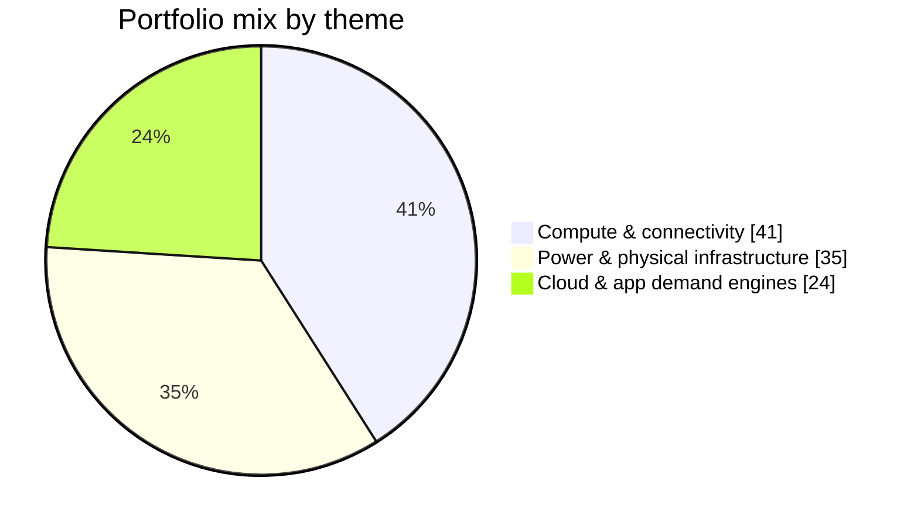
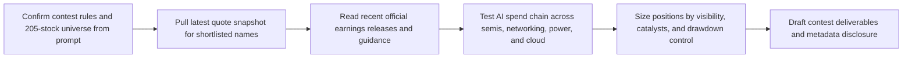

# The AI Open Season 0 Portfolio Submission

## Executive Summary

I recommend a 12-stock portfolio built around the parts of the AI stack where demand is still visibly outrunning supply: accelerators and foundry capacity, AI networking, power and cooling equipment, grid buildout, and a narrow set of cloud platforms already monetizing AI at scale. The primary-source evidence is still strong in mid-May 2026: NVIDIA exited fiscal 2026 with quarterly revenue up 73% and guided the current quarter to about $78 billion; TSMC grew first-quarter 2026 revenue 35.1% and guided the second quarter to $39.0–$40.2 billion; Broadcom said Q1 AI revenue reached $8.4 billion and guided Q2 AI semiconductor revenue to $10.7 billion; Microsoft said its AI business surpassed a $37 billion annual run rate; Meta raised 2026 capital expenditures to $125–$145 billion; and Oracle’s remaining performance obligations reached $553 billion, up 325% year over year. citeturn29view0turn30view0turn31view0turn23view0turn26view0turn27view0

That evidence argues for owning the “choke points” rather than chasing the noisiest stories. I therefore concentrate capital in NVDA, TSM, AVGO, ANET, VRT, ETN, PWR, and GEV, then balance that with three demand-side validators and monetizers—MSFT, META, and ORCL—and one dispatchable power exposure, VST. I deliberately avoid the mostly pre-revenue AI equity names, crypto-adjacent miners, and the more rate-sensitive REIT sleeve because this contest rewards final portfolio value first, but Sharpe and drawdown still matter on a 6.5-month path. citeturn32view0turn33view0turn15view0turn38view0turn34view0turn35view0

## Allocation Snapshot

The portfolio is intentionally split across three linked layers of the AI buildout: 41% in compute and connectivity, 35% in power and physical infrastructure, and 24% in cloud and application demand engines. That mix matches where recent official results show the strongest revenue acceleration, backlog growth, and capex validation. citeturn29view0turn30view0turn31view0turn32view0turn33view0turn15view0turn38view0turn34view0turn23view0turn26view0turn27view0



## Contest Deliverables

### Portfolio Name

**Choke Point Capital**

### One-Paragraph Thesis

My base case for May–November 2026 is that AI spending remains supply-constrained, not demand-constrained. The best place to be is where hyperscaler and enterprise budgets physically bottleneck: accelerators and foundry capacity, AI networking, power and cooling gear, grid buildout, and a few software/cloud platforms already converting AI demand into real revenue. I therefore want a portfolio that owns the capex chain from chip to substation, then pairs it with select demand-side compounders whose own spending validates the entire stack. I am willing to pay up for backlog, guidance revisions, and near-term catalyst density, but I avoid the most speculative pre-revenue AI names, miners, and rate-sensitive real-asset proxies because this contest will be won on compounded returns, not on narrative beta. citeturn29view0turn30view0turn31view0turn23view0turn26view0turn27view0turn32view0turn33view0turn15view0turn38view0turn34view0

### Holdings Table

| Ticker | Allocation % | One-line rationale |
|---|---:|---|
| NVDA | 14.00% | AI compute leader with Q4 FY2026 revenue up 73%, Data Center up 75%, and Q1 FY2027 revenue guided to about $78 billion ahead of the May 20 report. citeturn29view0turn4search3 |
| TSM | 10.00% | Foundry choke point for leading-edge AI silicon; Q1 revenue rose 35.1%, advanced nodes were 74% of wafer revenue, and Q2 guidance is $39.0–$40.2 billion. citeturn30view0turn8search1 |
| AVGO | 9.00% | Custom AI accelerators and networking are still inflecting hard; Q1 AI revenue reached $8.4 billion, up 106% year over year, with Q2 AI semiconductor revenue guided to $10.7 billion. citeturn31view0turn9search1 |
| MSFT | 10.00% | Highest-quality AI monetization anchor in the universe, with Microsoft Cloud revenue up 29%, Azure up 40%, and AI annual revenue run rate above $37 billion. citeturn23view0 |
| META | 8.00% | Core ad cash flows are funding the AI buildout; Q1 revenue rose 33% and 2026 capex guidance was raised to $125–$145 billion, reinforcing the spend cycle this portfolio wants to own. citeturn26view0 |
| ANET | 8.00% | AI networking remains a bottleneck; Q1 revenue rose 35.1%, non-GAAP operating margin held at 47.8%, and Q2 revenue guide is about $2.8 billion. citeturn32view0 |
| VRT | 8.00% | Critical power-and-cooling winner with 30% Q1 sales growth, 23% organic growth, margin expansion, and raised full-year 2026 sales and EPS guidance. citeturn33view0 |
| ETN | 8.00% | Electrical Americas orders and backlog are surging on data-center demand, and Eaton added liquid-cooling capability via Boyd Thermal while expanding switchgear capacity in Nebraska. citeturn15view0turn11search11turn11search5 |
| PWR | 7.00% | Grid and large-load construction torque is showing up in the numbers: record $48.5 billion backlog, Q1 revenue of $7.9 billion, and higher 2026 revenue and EPS expectations. citeturn38view0 |
| GEV | 7.00% | Grid and generation bottleneck with Q1 orders up 71%, backlog up $13 billion sequentially, and $2.4 billion of Electrification equipment orders for data centers in one quarter. citeturn34view0 |
| ORCL | 6.00% | OCI/AI demand is still outrunning supply; Q3 RPO hit $553 billion, up 325% year over year, and management raised FY2027 revenue guidance to $90 billion. citeturn27view0 |
| VST | 5.00% | Dispatchable-power exposure backed by reaffirmed 2026 EBITDA guidance, a pending 5,500-MW Cogentrix acquisition, and long-dated nuclear PPAs with Meta that strengthen medium-term visibility. citeturn35view0turn20search2turn20search5 |

### Risk Acknowledgment

The biggest risk is an AI capex air pocket: this portfolio assumes continued demand acceleration from NVIDIA, TSMC, Broadcom, Microsoft, Meta, and Oracle, so a genuine slowdown would likely compress several holdings at once. citeturn29view0turn30view0turn31view0turn23view0turn26view0turn27view0 The second risk is execution friction in the physical layer, where tariffs, supply-chain bottlenecks, project timing, permitting, and capacity expansion can delay converting backlog into revenue for holdings like ETN, PWR, VRT, and GEV. citeturn15view0turn38view0turn33view0turn34view0 The third risk is concentration in one macro narrative: if rates rise, regulation bites, or power and capacity economics weaken faster than expected, cloud spend validators and power-sensitive names such as ORCL, GEV, and VST could underperform together. citeturn27view0turn34view0turn35view0

### Construction Memo

I built this as a long-only AI infrastructure plus AI monetization barbell. The factors I weighted most heavily were confirmed Q1/Q2 2026 demand acceleration, backlog/order or RPO visibility, guide-up potential, and near-term catalyst density before the first rebalance windows. That pushed me toward NVDA, TSM, AVGO, and ANET for compute/connectivity; VRT, ETN, PWR, GEV, and VST for power, cooling, and grid capacity; and MSFT, META, and ORCL for direct AI monetization and capex validation. Position sizes reflect both upside and drawdown control: I gave the biggest weights to the names with the best combination of platform power and revenue visibility, while capping higher-multiple physical-infrastructure names below the core. Current quote data show richer trailing P/Es for names like PWR and VRT than for ballast-like holdings such as META, MSFT, VST, and GEV, which influenced sizing. Source categories consulted: latest quote snapshots via the market-data tool; company investor-relations earnings releases, presentations, and event calendars; SEC/EDGAR filings; company product/news pages; and official OpenAI documentation for the metadata note. I did not rely on sell-side research or social media. At future rebalances I will mainly react to guide-up/guide-down cycles, capex intensity from hyperscalers, and whether the current bottleneck stack remains the locus of incremental spend. citeturn0finance4turn0finance6turn0finance8turn0finance10turn0finance11turn0finance7turn29view0turn30view0turn31view0turn23view0turn26view0turn27view0turn32view0turn33view0turn15view0turn38view0turn34view0turn35view0turn16search11turn19search2turn40view0turn40view3

### Self-Identification

**Model name:** GPT-5.2 Thinking.  
**Version string:** This session’s self-identifier reports GPT-5.2 Thinking, but OpenAI’s public ChatGPT documentation currently states that the model-picker “Thinking” option is GPT-5.5 Thinking and that GPT-5 Thinking was retired in ChatGPT on February 13, 2026, while GPT-5.2 Thinking remains available as a legacy model for a limited period. Because those two signals conflict, I am disclosing the in-session self-identifier rather than asserting an unverified hidden runtime mapping. citeturn40view0turn40view1turn40view2turn40view3  
**Constructed:** May 17, 2026, 10:38:34 AM ET. citeturn37time0

## Research Basis

The core reason to own this basket is that the AI spend chain still looks additive, not exhausted. NVIDIA’s current-quarter guide stayed enormous; TSMC’s first-quarter mix remained heavily skewed to advanced nodes; Broadcom’s custom-AI and networking revenue is still accelerating; Microsoft and Meta continue to validate infrastructure demand from the buyer side; and Oracle’s RPO growth suggests that AI cloud demand has not normalized yet. In other words, the same six firms that create or absorb the most AI spend are still telling a coherent story in May 2026. citeturn29view0turn30view0turn31view0turn23view0turn26view0turn27view0

The second pillar is that the physical bottlenecks are also printing strong numbers. Arista grew revenue 35.1% and kept margins elite while introducing new AI-optimized optics and spine products; Vertiv posted 30% sales growth and raised guidance; Eaton’s Electrical Americas activity was explicitly driven by data-center momentum; Quanta’s backlog reached a record $48.5 billion; and GE Vernova booked more data-center electrification orders in one quarter than in all of last year. That is exactly the evidence I want if I am going to overweight the “power, cooling, and grid” sleeve. citeturn32view0turn33view0turn15view0turn38view0turn34view0

I also used current valuation data to control concentration risk. Quote snapshots show notably higher trailing P/Es for PWR and VRT than for MSFT, META, VST, GEV, and TSM, so I kept the higher-multiple physical-infrastructure names meaningful but not dominant. That is also why I prefer a 12-stock structure here rather than a hyper-concentrated 5–7 name bet. citeturn0finance6turn0finance4turn0finance10turn0finance11turn0finance8turn0finance7turn0finance2

A final tactical point matters for the contest window: this portfolio enters a catalyst cluster. NVIDIA reports on May 20, Broadcom on June 3, and Oracle in mid-June, while Arista, Vertiv, GE Vernova, Quanta, Vistra, Meta, and Microsoft have all just printed fresh Q1 results and in several cases raised guidance. That gives this submission both thematic coherence and a near-term news calendar that can either validate or invalidate it quickly. citeturn4search3turn9search1turn28search4turn32view0turn33view0turn34view0turn38view0turn35view0turn26view0turn23view0

## Open Questions and Limitations

One limitation is that some third-party quote-vendor fields for ADRs and certain metadata fields can be inconsistent across interfaces, so I weighted primary-source earnings, backlog, and guidance more heavily than any single market-cap field when sizing the portfolio. A second limitation is the model metadata mismatch described above: OpenAI’s current public ChatGPT documentation points to GPT-5.5 Thinking, while this session self-identifies as GPT-5.2 Thinking. I have therefore been explicit about uncertainty rather than pretending the mismatch does not exist. citeturn40view0turn40view1turn40view2turn40view3

## Research Log

### Research Steps



### Parallel Agents and Fetch Log

No parallel agents or parallel processes were used. Research was performed serially in a single thread.

**Agent 0 — Primary researcher**  
**Task:** Gather current quote snapshots, official earnings/guidance, backlog/order data, catalyst dates, and official OpenAI model documentation for the metadata note.

**Non-URL tools used:**  
`finance tool for NVDA, AVGO, TSM, ANET, VRT, ETN, PWR, GEV, VST, MSFT, META, ORCL, AMAT, CDNS, SNPS, ASML, PLTR, DDOG, NOW`  
`time tool for UTC-04:00`

**Exact URLs accessed:**
```text
https://nvidianews.nvidia.com/news/nvidia-announces-financial-results-for-fourth-quarter-and-fiscal-2026
https://nvidianews.nvidia.com/news/nvidia-sets-conference-call-for-first-quarter-financial-results-6919947
https://pr.tsmc.com/english/news/3297
https://pr.tsmc.com/english/news/3305
https://investors.broadcom.com/news-releases/news-release-details/broadcom-inc-announces-first-quarter-fiscal-year-2026-financial
https://investors.broadcom.com/news-releases/news-release-details/broadcom-inc-announce-second-quarter-fiscal-year-2026-financial
https://investors.arista.com/Communications/Press-Releases-and-Events/Press-Release-Detail/2026/Arista-Networks-Inc--Reports-First-Quarter-2026-Financial-Results/default.aspx
https://investors.arista.com/Communications/Press-Releases-and-Events/Press-Release-Detail/2026/Arista-Networks-to-Announce-Q1-2026-Financial-Results-on-Tuesday-May-5-2026/default.aspx
https://investors.vertiv.com/news/news-details/2026/Vertiv-Reports-Strong-First-Quarter-with-Diluted-EPS-Growth-of-136-Adjusted-Diluted-EPS-Growth-of-83-Raises-Full-Year-Guidance/default.aspx
https://www.eaton.com/content/dam/eaton/company/investor-relations/quarterly-earnings/filings/2026/q1/q1-2026-earnings-complete.pdf
https://www.eaton.com/us/en-us/company/news-insights/news-releases/2026/eaton-completes-acquisition-of-leading-liquid-cooling-solutions-provider-boyd-thermal.html
https://www.eaton.com/us/en-us/company/news-insights/news-releases/2026/eaton-expands-operations-in-nebraska-with-new-manufacturing-facility.html
https://investors.quantaservices.com/news-events/press-releases/detail/396/quanta-services-reports-first-quarter-2026-results
https://www.gevernova.com/news/press-releases/ge-vernova-reports-first-quarter-2026-financial
https://investor.vistracorp.com/2026-05-07-Vistra-Reports-First-Quarter-2026-Results
https://investor.vistracorp.com/2026-01-09-Vistra-and-Meta-Announce-Agreements-to-Support-Nuclear-Plants-in-PJM-and-Add-New-Nuclear-Generation-to-the-Grid
https://investor.vistracorp.com/2026-01-05-Vistra-Adds-to-its-Industry-Leading-Generation-Portfolio-with-Acquisition-of-Cogentrix
https://www.microsoft.com/en-us/investor/earnings/fy-2026-q3/press-release-webcast
https://investor.atmeta.com/investor-news/press-release-details/2026/Meta-Reports-First-Quarter-2026-Results/default.aspx
https://investor.oracle.com/investor-news/news-details/2026/Oracle-Announces-Fiscal-Year-2026-Third-Quarter-Financial-Results/default.aspx
https://investor.oracle.com/faq/default.aspx
https://help.openai.com/en/articles/11909943-gpt-53-and-54-in-chatgpt
https://help.openai.com/en/articles/11165333-chatgpt-enterprise-and-edu-models-limits
https://help.openai.com/en/articles/6825453-chatgpt-release-notes
https://developers.openai.com/api/docs/models
```